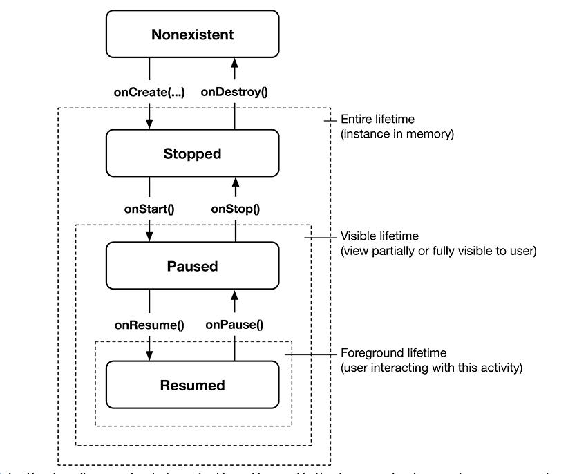

# 03 The Activity Lifecycle 

Activity State Lifecycle

* Nonexistent: activity that has not been launched or has just been destroyed. No instance is in memory. Enter this state when user presses the back button. There is no associated view for the user to see or interact with.

* Stopped: represents an activity that has an instance in memory but whose view
is not visible on the screen. This state occurs in passing when activity is first
spinning and reoccurs when the view is fully occluded. Occurs when user presses the
home button or uses an overview screen to switch tasks.

* Paused: activity that is not active in the foreground but whose view is visible or
partially visible.  This could occur when two activities are in multi-window mode
or split-screen mode. 

* Resumed: is an activity that is in memory and fully visible and in the foreground.
    Only one activity across the entire system can be in the resumed state at any 
    given time. If one activity is moving to resumed state likely another activity is 
    going out of resumed state.

**Lifecycle Callbacks** are used by Activity subclasses to get work done at 
    critical transitions int he activity's lifecycle.

## Logging the Activity Lifecycle

There are four main methods for logging that can be used:

1. Log.d: debug messages
1. Log.i: informational message
1. Log.w: warning
1. Log.e: error messages
1. Log.v: verbose mode only occurs in development mode

!!! Note
    There are two signatures for each logging message. 
    log.x(tag, msg), log.x(tag, msg, throwable)

- Each time you rotate the device your activity is completely destroyed.

## Device Configuration Changes and the Activity Lifecycle

Rotating device changes the device configuration.

Device configuration includes:

* screen orientation
* screen density
* screen size
* keyboard type
* doc
* language
* and etc.

When runtime configuration changes Android destroys the activity and tries to find
a better matched resource.

For landscape mode the "-land" qualifier use used in the "res" directory.

The layout files must have the same filename (can be referenced with same resource ID)

## UI Updates in Multi-Window Mode 

After Nougat more than one Activity could be fully visible.  This broke the assumption
that onResume() and onPause() could be used to start and stop any ongoing updates 
related to UI (e.g. animations or data refreshes)

Multi-resume only works for devices that are implemented by manufacturer. But not
    implemented in any device as of today. In Multi-resume all visible windows can
    be in resume state.
