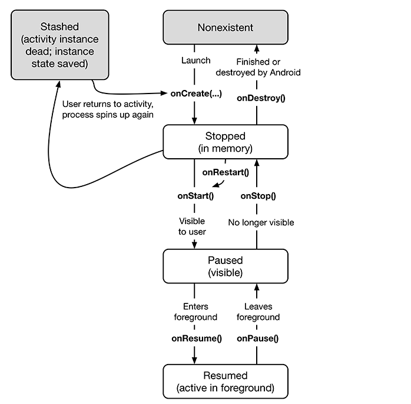

# 04 Persisting UI State

## ViewModel
- ViewModel: comes from Android Jetpack library called lifecycle-extensions
- Need to include ViewModel as a dependency in app/build.gradle

```text
dependencies {
implementation 'androidx.constraintlayout:constraintlayout:1.1.2'
implementation 'androidx.lifecycle:lifecycle-extensions:2.0.0'  
...
}
```

- When app is compiled gradle will find, download and include all the dependencies for you.


- lifecycle class makes dealing with activity lifecycle much less painful

### Adding view model

- right-click "com.bignerdranch.android.geoquiz" -> New Kotlin File/Class the create:

```java
private const val TAG = "QuizViewModel"

class QuizViewModel : ViewModel() {

    init {
        Log.d(TAG, "ViewModel instance created")
    }

    override fun onCleared() {
        super.onCleared()
        Log.d(TAG, "ViewModel instance about to be destroyed")
    }
}
```

Need to associate Activity with ViewModel in the create method:

```java
class MainActivity : AppCompatActivity() {
    ...
    override fun onCreate(savedInstanceState: Bundle?) {
    ...
    setContentView(R.layout.activity_main)

    val provider: ViewModelProvider = ViewModelProviders.of(this)
    val quizViewModel = provider.get(QuizViewModel::class.java)
    Log.d(TAG, "Got a QuizViewModel: $quizViewModel")

    trueButton = findViewById(R.id.true_button)
    ...
    }
...
}
```

ViewModelProvider acts as a registry of ViewModels.

- creates and returns new ViewModel instance
- on configuration change it returns the same ViewModel that was created
- when activity is finished (when user presses back button) the ViewModel activity pair is removed from memory
- Activity can be destroyed by user explicitly finishing activity or the OS the system destroying it as a result of configuration change
- An activities isFinishing property can be used to see if an activity is going to finish
- ViewModel is associated with an activity's lifecycle. Is survives configuration change and is destroyed when the activity is finished
- ViewModel will remain in memory until an activity is finished


If isFinishing is False ViewModel remains in memory. If isFinishing is True ViewModel will be destroyed.

During Rotation QuizViewModel remains in memory.

!!! Note
    the relationship between Activity and ViewModel is unidirectional. Activity references ViewModle but ViewModel does not access activity. Your ViewModel should NEVER hold a reference to your activity as it will cause a memory leak.

Use "lazy" to make property a val instead of a var. Use when the value of the property will not change after initialization. Calculation and assignment will not happen until the first time you access ViewModel:

```java
private val quizViewModel: QuizViewModel by lazy {
    ViewModelProviders.of(this).get(QuizViewModel::class.java)
}

```

without "lazy" if you try to call
ViewModelProviders.of(this).get(QuizViewModel::class.java) before
Activity.onCreate(…), your app will crash with an IllegalStateException.


## Saving Data Across Process Death

- App's process can be destroyed by OS if user navigates away for a while and Android needs to reclaim memory
- Processes containing resumed or paused activities get higher priority than other processes when OS reclaims memory
- if a foreground process is reclaimed it means that something has horribly gone wrong
- stopped activities are fair game to be destroyed 
- when an app descroyes an activity ViewModels stored in memory will be wiped away

Use "savedInstanceState" to persist data across process death. It is data that the OS stores temporarily outside the activity

OS calls Activity.onSsavedInstanceState(Bundle) when activity moves to the stopped state

- Bundle is a structure that maps string keys to values of certain limited types

- When you override onCreate(Bundle?) on activity's superclass and pass in the bundle. The superclass implementation, the saved state of the views is retrieved and used to re-create the activity's view hierarchy.

- additional data can be saved in the bundle and can be read back. This can be used to preserved state


- onCreate accepts a nullable bundle as an input because there is no state when new instance of the activity is launched by the user for the first time.

- on rotation the bundle will be not null

Can set the emulator to kill an activity when the activity is in stopped state. 

1. make sure you are in developer mode
1. Developer Options (under Advanced section) -> got to Apps section. Click on the option: Don't keep activities

- pressing home button cuases the activity to be paused and stopped 

- When activity is finished the bundle will be destroyed





## ViewModel vs Saved Instance State

- ViewModel not ideal for small hardcoded values. It shines when you are orchestrating dynamic data for an activity. Can simplify download operations accross configuration changes.
- ViewModel not good during process death since it does not preserve its state. Android is releasing a new library lifecycle-viewmodel-savedstate to save ViewModel state across process death.
- use SavedInstanceState to store minimal amount of information to recreate UI state

- There is no easy way to determine whether an activity is being recreated after process death versus a configuration change. If you use a saved instance state data to update ViewModel after a configuration change your app is doing unnecessary work

Permanent storage options:

- local database (for more complex data)
- local shared preference 
- remote database

### Jetpack, AndroidX and Architecture Components

- lifecycle-extensions library contains ViewModel
- JetPack components are called JetPack for short, is a set of libraries created by Google to make Android development easier

Jetpack libraries can be found at:

```java
developer.android.com/jetpack
```

Jetpack libraries start with androidx

In the New Project Wizard make sure click the checkbox for Use AndroidX artifacts

There are four major categories for androidx libraries:

1. foundation
1. architecture  - referred to architecture components
1. behavior
1. ui

Some jetpack libraries are entirely new others have been around for a while. If you hear about Support Library know that this is legacy and you should use the jetpack version


### half-baked solution

- Disabling rotation is not a way to prevent loss of UI state
- It can leave other lifecycle bugs
- many configuration changes can occur at runtime such as window resizing or night modes.
- capturing and ingnoritng all those handles is simply bad practice.
- best practice to always program defensively against configuration changes and process death
